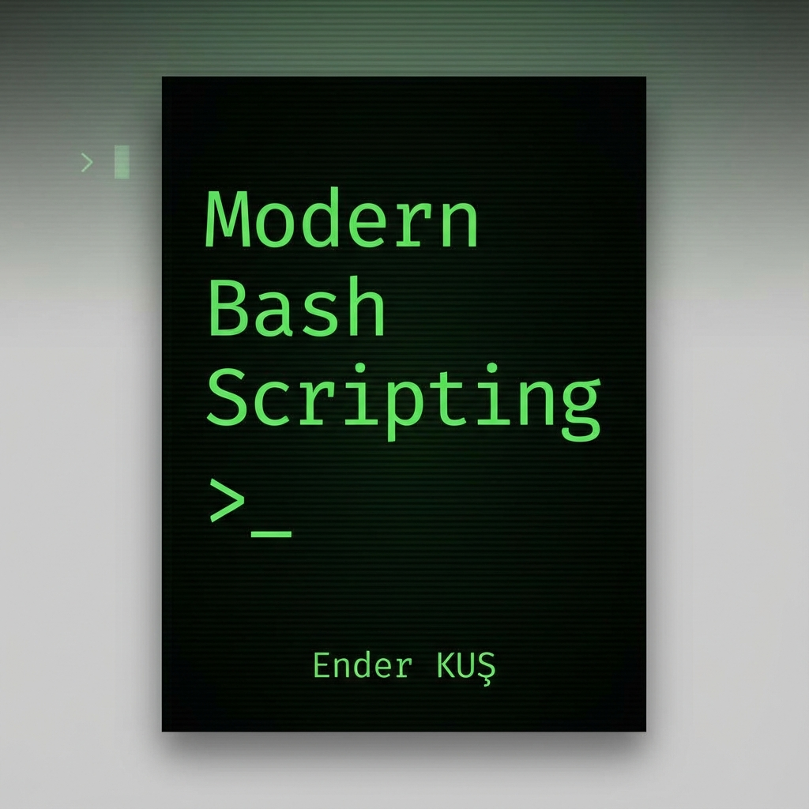

# Modern Bash Scripting: Sıfırdan İleri Seviyeye

    
      
    

Bu depo, **Modern Bash Scripting** kitabının güncel **PDF** ve **HTML** sürümlerini barındırır.

Kitap, Linux dünyasında terminal, otomasyon ve sistem yönetimi konularında yetkinlik kazanmak isteyenler için kapsamlı, Türkçe bir rehberdir.

## 📖 Formatlar
Dosyalar bölümünde veya ana dizinde aşağıdaki formatları bulabilirsiniz:

*   **📄 PDF Versiyonu:** Kitabın baskıya hazır, sayfa düzeni yapılmış hali. Tabletler ve e-kitap okuyucular için idealdir.
*   **🌐 HTML Versiyonu:** Tarayıcı üzerinden okumak için tek sayfa web formatı.

## 📚 İçindekiler
Kitap toplam 12 bölüm ve eklerden oluşmaktadır:

1.  **Temeller ve Giriş:** Terminal, Shell kavramı, ilk script, izinler.
2.  **Değişkenler ve Veri Tipleri:** Stringler, sayılar, `readonly` değişkenler.
3.  **Kullanıcı Etkileşimi:** `read` komutu, argüman ($1, $2) kullanımı.
4.  **Diziler (Arrays):** Dizi tanımlama, ekleme/çıkarma ve döngüyle okuma.
5.  **Aritmetik İşlemler:** `(( ))`, `bc` ve matematiksel operatörler.
6.  **Metin (String) İşlemleri:** Kesme, biçimlendirme, arama/değiştirme.
7.  **Karar Yapıları:** `if-else`, `case` yapıları ve test operatörleri.
8.  **Döngüler:** `for`, `while`, `until` döngüleri.
9.  **Fonksiyonlar:** Fonksiyon tanımlama, parametreler, `return` değeri, `local` değişkenler.
10. **Girdi/Çıktı ve Dosya İşlemleri:** Yönlendirmeler (`>`, `|`), dosya analizleri.
11. **Otomasyon ve İleri Konular:** Cron, Regex, Debugging, `awk`, `sed`.
12. **Projeler:**
    *   Sistem Raporlama Aracı
    *   Otomatik Yedekleme Scripti
    *   Log Analiz Aracı
    *   Kullanıcı Yönetim Otomasyonu
*   **Ekler:** Terminal Kısayolları ve Genişletilmiş Linux Komutları Referansı.

## ✍️ Yazar
Ender KUŞ

## ⚠️ Yasal Uyarı
Bu kitapta yer alan kodlar, scriptler ve teknik bilgiler eğitim ve rehberlik amacıyla hazırlanmıştır. Yazar, bu bilgilerin kullanımından doğabilecek veri kaybı, sistem hatası veya güvenlik açıklarından sorumlu tutulamaz.

Özellikle sistem dosyalarını değiştiren (`rm`, `dd`, `chmod` vb.) komutları ve scriptleri denerken, her zaman **sanal makine veya test ortamı** kullanmanız, üretim (production) ortamında uygulamadan önce mutlaka yedek almanız önerilir.

Tüm sorumluluk kullanıcıya aittir.
